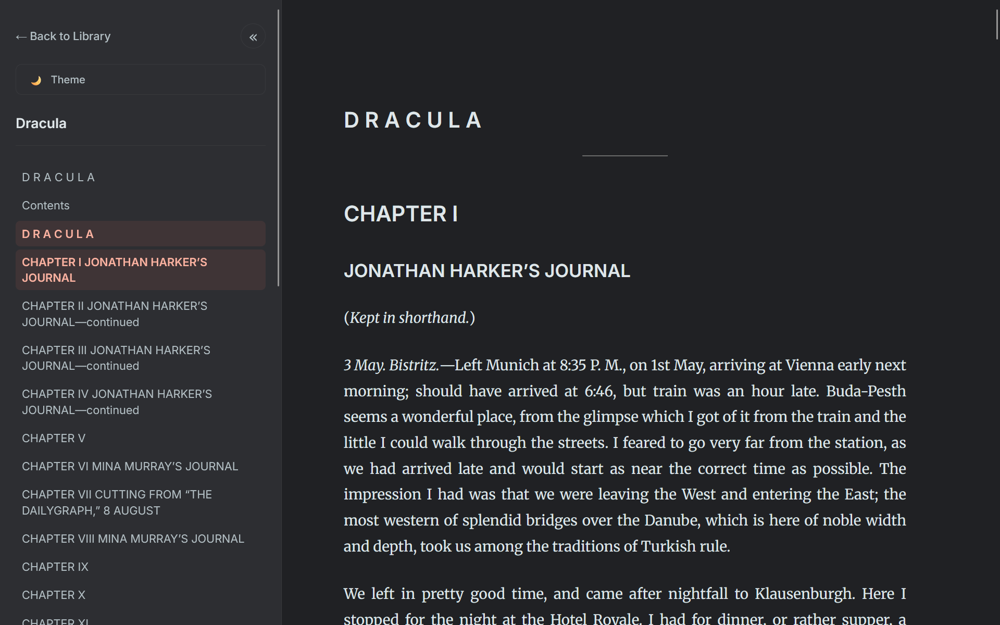

# Reader3 - Modern EPUB Reader



A feature-rich, self-hosted EPUB reader with a modern UI, book management, and image optimization.

## ✨ Features

### 📚 Book Management
- **Web Upload**: Upload EPUB files directly through the browser
- **Library View**: Beautiful card-based library with dark mode support
- **Mark as Finished**: Track your reading progress
- **Delete Books**: Remove books with confirmation dialog
- **Progress Tracking**: Visual upload progress bar

### 📖 Reading Experience
- **Chapter Navigation**: Navigate through book chapters easily
- **Table of Contents**: Sidebar with full TOC
- **Dark Mode**: Eye-friendly dark theme
- **Highlight & Notes**: Highlight text and add personal notes
- **Translation**: Translate selected text to multiple languages
- **Responsive Design**: Works on desktop and mobile

### 🖼️ Image Optimization
- **Automatic Compression**: Images are optimized during upload
- **Smart Resizing**: Max 800px width while maintaining aspect ratio
- **Quality Balance**: 65% JPEG quality for optimal size/quality ratio
- **Significant Size Reduction**: Reduces image sizes by 60-80%

## 🚀 Quick Start

### Prerequisites
- Python 3.10+
- [uv](https://docs.astral.sh/uv/) package manager

### Installation

1. Clone or download this repository
2. Install dependencies (handled automatically by `uv`)

### Running the Server

```bash
uv run server.py
```

Visit [http://localhost:8123](http://localhost:8123) to access your library.

### Adding Books

**Option 1: Web Upload (Recommended)**
1. Open the library in your browser
2. Click "📤 Upload Book" button
3. Select your EPUB file
4. Wait for the progress bar to complete

**Option 2: Command Line**
```bash
uv run reader3.py your-book.epub
```

This creates a `your-book_data` directory with the processed book.

## 📁 Project Structure

```
reader3/
├── server.py              # FastAPI server
├── reader3.py            # EPUB processing script
├── templates/
│   ├── library.html      # Library page
│   └── reader.html       # Reading interface
├── pyproject.toml        # Dependencies
└── [book]_data/          # Processed book directories
    ├── book.pkl          # Book metadata
    ├── status.json       # Reading status
    └── images/           # Optimized images
```

## 🎨 Features in Detail

### Library Management
- Modern card-based UI with hover effects
- Book status badges (Finished/Reading)
- Quick actions: Read, Mark Finished, Delete
- Theme toggle (Light/Dark mode)

### Reading Interface
- Clean, distraction-free reading
- Sidebar with TOC (collapsible)
- Highlight text with notes
- Translate selected text
- Chapter navigation (Previous/Next)
- Dark mode support

### Image Optimization
Images are automatically optimized during upload:
- **Max Width**: 800px (maintains aspect ratio)
- **Quality**: 65% JPEG compression
- **Format**: Converts to JPEG for smaller size
- **Logging**: Shows compression ratio in console

## 🔧 Configuration

### Environment Variables
Create a `.env` file for optional features:

```env
# AI Chat (Optional - removed in current version)
GEMINI_API_KEY=your_key_here
GROQ_API_KEY=your_key_here
AI_PROVIDER=gemini
```

### Customization
- **Image Quality**: Edit `max_width` and `quality` in `reader3.py` line 71
- **Server Port**: Change port in `server.py` line 306
- **Theme Colors**: Modify CSS variables in `library.html` and `reader.html`

## 📦 Dependencies

- **FastAPI**: Web framework
- **Uvicorn**: ASGI server
- **ebooklib**: EPUB parsing
- **BeautifulSoup4**: HTML processing
- **Pillow**: Image optimization
- **Jinja2**: Template rendering
- **deep-translator**: Text translation
- **python-multipart**: File upload handling

## 🎯 Usage Tips

1. **Upload Progress**: Large books may take 30-60 seconds to process
2. **Image Optimization**: First upload processes and optimizes all images
3. **Highlights**: Click highlighted text to view/edit notes
4. **Translation**: Select text and choose target language
5. **Dark Mode**: Preference is saved in browser localStorage

## 📝 Notes

- Books are stored in `[filename]_data` directories
- Highlights and notes are saved in browser localStorage per chapter
- Reading status is saved in `status.json` per book
- Delete operation removes the entire book directory

## 🤝 Contributing

This is a personal project. Feel free to fork and modify for your needs.

## 📄 License

MIT

## 🙏 Credits

Original concept by Andrej Karpathy for reading books with LLMs.
Enhanced with modern UI, book management, and optimization features.